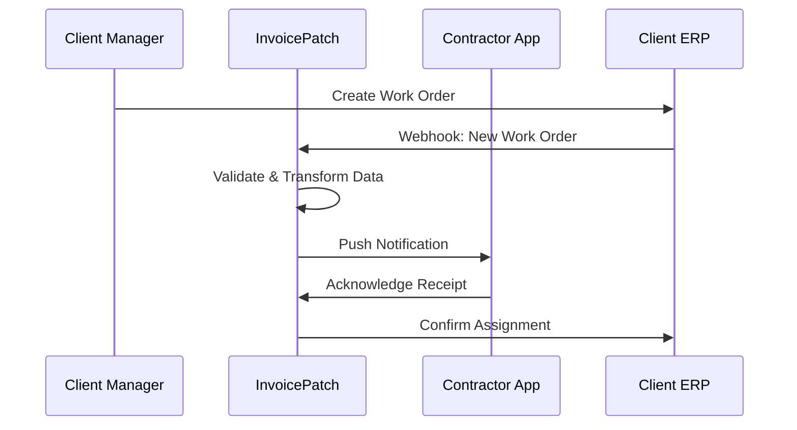

# InvoicePatch Client Billing System Integration Platform
## Technical Specification v1.0

### Executive Summary

The InvoicePatch Integration Platform transforms contractor billing from manual invoice submission to automated, real-time synchronization with client business systems. This specification outlines a comprehensive B2B integration solution targeting Canadian construction, electrical, plumbing, and service contractors.

## 1. Architecture Overview

### 1.1 System Architecture

```
┌─────────────────────────────────────────────────────────────────┐
│                    InvoicePatch Integration Platform            │
├─────────────────────────────────────────────────────────────────┤
│  ┌─────────────────┐  ┌─────────────────┐  ┌─────────────────┐ │
│  │   Contractor    │  │   Integration   │  │   Client        │ │
│  │   Dashboard     │  │   Engine        │  │   Dashboard     │ │
│  └─────────────────┘  └─────────────────┘  └─────────────────┘ │
├─────────────────────────────────────────────────────────────────┤
│  ┌─────────────────┐  ┌─────────────────┐  ┌─────────────────┐ │
│  │   Mobile App    │  │   API Gateway   │  │   Webhook       │ │
│  │   (Contractors) │  │   & Rate        │  │   Manager       │ │
│  └─────────────────┘  │   Limiter       │  └─────────────────┘ │
│                       └─────────────────┘                      │
├─────────────────────────────────────────────────────────────────┤
│  ┌─────────────────┐  ┌─────────────────┐  ┌─────────────────┐ │
│  │   Integration   │  │   Data          │  │   Notification  │ │
│  │   Connectors    │  │   Transformer   │  │   System        │ │
│  └─────────────────┘  └─────────────────┘  └─────────────────┘ │
├─────────────────────────────────────────────────────────────────┤
│  ┌─────────────────┐  ┌─────────────────┐  ┌─────────────────┐ │
│  │   PostgreSQL    │  │   Redis Cache   │  │   File Storage  │ │
│  │   (Primary DB)  │  │   & Queue       │  │   (S3/Azure)    │ │
│  └─────────────────┘  └─────────────────┘  └─────────────────┘ │
└─────────────────────────────────────────────────────────────────┘
```

### 1.2 Core Components

#### **Integration Engine**
- **Purpose**: Central hub for all business system connections
- **Technology**: Node.js/TypeScript with Express.js
- **Features**: Connection pooling, retry logic, error handling
- **Scalability**: Horizontal scaling with load balancers

#### **Data Transformer**
- **Purpose**: Normalize data between different systems
- **Technology**: Apache Kafka for stream processing
- **Features**: Real-time data transformation, validation, enrichment
- **Performance**: 10,000+ transactions per second

#### **API Gateway**
- **Purpose**: Single entry point for all external integrations
- **Technology**: Kong or AWS API Gateway
- **Features**: Rate limiting, authentication, logging, monitoring
- **Security**: OAuth 2.0, API key management, IP whitelisting

## 2. Integration Capabilities

### 2.1 QuickBooks Integration

#### **QuickBooks Online API**
```typescript
interface QuickBooksConnector {
  // Customer management
  syncCustomers(): Promise<Customer[]>;
  createCustomer(customer: CustomerData): Promise<string>;
  
  // Items and services
  syncItems(): Promise<Item[]>;
  createItem(item: ItemData): Promise<string>;
  
  // Invoice operations
  createInvoice(invoice: InvoiceData): Promise<string>;
  getInvoice(id: string): Promise<Invoice>;
  updateInvoiceStatus(id: string, status: InvoiceStatus): Promise<void>;
  
  // Project tracking
  syncProjects(): Promise<Project[]>;
  trackTime(timeEntry: TimeEntryData): Promise<string>;
  
  // Reporting
  getAgedReceivables(): Promise<Report>;
  getCashFlow(): Promise<Report>;
}
```

#### **QuickBooks Desktop Integration**
- **Method**: QuickBooks SDK via COM interface
- **Deployment**: Windows service on client premises
- **Sync**: Scheduled synchronization (hourly/daily)
- **Data**: IIF file generation for bulk imports

#### **Integration Points**
1. **Work Orders → Projects**
   - Automatic project creation from work orders
   - Budget tracking and variance reporting
   - Time tracking integration

2. **Contractor Rates → Item Pricing**
   - Dynamic rate updates based on contracts
   - Skill-based pricing tiers
   - Geographic rate adjustments

3. **Invoice Automation**
   - Auto-generation from approved time entries
   - Configurable approval workflows
   - Automatic posting to QuickBooks

### 2.2 Sage 50 Integration

#### **Sage 50 Canadian Edition**
```typescript
interface Sage50Connector {
  // Company database connection
  connectToCompany(dbPath: string, credentials: Credentials): Promise<void>;
  
  // Vendor management (contractors)
  syncVendors(): Promise<Vendor[]>;
  createVendor(vendor: VendorData): Promise<string>;
  
  // Job costing
  syncJobs(): Promise<Job[]>;
  createJob(job: JobData): Promise<string>;
  updateJobCosts(jobId: string, costs: CostEntry[]): Promise<void>;
  
  // Purchase order integration
  createPO(po: PurchaseOrderData): Promise<string>;
  receivePO(poId: string, items: ReceiptData[]): Promise<void>;
  
  // Expense management
  createExpense(expense: ExpenseData): Promise<string>;
  approveExpense(expenseId: string): Promise<void>;
}
```

#### **Integration Architecture**
- **Connection**: Direct SQL Server connection to Sage 50 database
- **Security**: VPN tunnel with encrypted connections
- **Sync**: Real-time triggers on data changes
- **Backup**: Automatic database backups before modifications

#### **Sage 50 Specific Features**
1. **Job Costing Integration**
   - Automatic cost allocation by job phase
   - WIP (Work in Progress) reporting
   - Job profitability analysis

2. **Canadian Payroll Integration**
   - T4 slip generation for contractors
   - CRA compliance for contractor payments
   - Workers' compensation integration

### 2.3 Xero Integration

#### **Xero API Implementation**
```typescript
interface XeroConnector {
  // OAuth 2.0 authentication
  authenticate(tenantId: string): Promise<AccessToken>;
  refreshToken(refreshToken: string): Promise<AccessToken>;
  
  // Contact management
  syncContacts(): Promise<Contact[]>;
  createContact(contact: ContactData): Promise<string>;
  
  // Invoice processing
  createInvoice(invoice: InvoiceData): Promise<Invoice>;
  approveInvoice(invoiceId: string): Promise<void>;
  sendInvoice(invoiceId: string, options: SendOptions): Promise<void>;
  
  // Bank reconciliation
  getBankTransactions(): Promise<BankTransaction[]>;
  reconcileTransaction(transactionId: string, invoiceId: string): Promise<void>;
  
  // Reporting
  getProfitLoss(period: DateRange): Promise<Report>;
  getBalanceSheet(date: Date): Promise<Report>;
}
```

### 2.4 Microsoft Dynamics Integration

#### **Dynamics 365 Business Central**
```typescript
interface DynamicsConnector {
  // Web services integration
  connectToTenant(tenantId: string, credentials: OAuthCredentials): Promise<void>;
  
  // Vendor management
  syncVendors(): Promise<Vendor[]>;
  createVendor(vendor: VendorData): Promise<string>;
  updateVendorRates(vendorId: string, rates: RateCard[]): Promise<void>;
  
  // Project management
  syncProjects(): Promise<Project[]>;
  createProject(project: ProjectData): Promise<string>;
  updateProjectStatus(projectId: string, status: ProjectStatus): Promise<void>;
  
  // Resource planning
  getResourceAvailability(dateRange: DateRange): Promise<ResourceSlot[]>;
  scheduleResource(resourceId: string, booking: BookingData): Promise<string>;
  
  // Purchase requisitions
  createRequisition(requisition: RequisitionData): Promise<string>;
  approveRequisition(requisitionId: string): Promise<void>;
}
```

### 2.5 Custom ERP Integration

#### **Generic ERP Connector Framework**
```typescript
interface ERPConnectorConfig {
  systemType: 'SAP' | 'Oracle' | 'Custom';
  connectionMethod: 'REST' | 'SOAP' | 'Database' | 'FileSync';
  endpoints: {
    auth: string;
    vendors: string;
    projects: string;
    invoices: string;
  };
  authentication: {
    type: 'OAuth2' | 'BasicAuth' | 'ApiKey' | 'Certificate';
    credentials: Record<string, string>;
  };
  dataMapping: FieldMappingConfig[];
  syncSchedule: CronConfig;
}

class CustomERPConnector implements BaseConnector {
  constructor(private config: ERPConnectorConfig) {}
  
  async connect(): Promise<void> {
    // Dynamic connection based on configuration
  }
  
  async syncData(entityType: string): Promise<any[]> {
    // Generic data synchronization
  }
  
  async transformData(data: any[], mapping: FieldMappingConfig[]): Promise<any[]> {
    // Dynamic data transformation
  }
}
```

### 2.6 Excel-Based Systems Integration

#### **Excel File Processing**
```typescript
interface ExcelConnector {
  // File operations
  uploadFile(file: File, template: ExcelTemplate): Promise<string>;
  downloadFile(format: 'xlsx' | 'csv', data: any[]): Promise<Buffer>;
  
  // Template management
  createTemplate(template: ExcelTemplateConfig): Promise<string>;
  validateTemplate(file: File, templateId: string): Promise<ValidationResult>;
  
  // Data processing
  parseExcelData(file: File): Promise<ParsedData>;
  generateExcelReport(data: ReportData, template: string): Promise<Buffer>;
  
  // Automation
  scheduleExport(schedule: CronConfig, template: string): Promise<string>;
  processDropboxFiles(folderPath: string): Promise<ProcessingResult[]>;
}
```

#### **Excel Integration Features**
1. **Smart Template Recognition**
   - AI-powered column mapping
   - Automatic data type detection
   - Error correction suggestions

2. **Real-time Collaboration**
   - SharePoint/OneDrive integration
   - Automatic file versioning
   - Conflict resolution

3. **Data Validation**
   - Formula verification
   - Data integrity checks
   - Duplicate detection

## 3. Data Synchronization Architecture

### 3.1 Real-time Data Flow

```typescript
interface DataSyncEngine {
  // Event-driven synchronization
  onWorkOrderCreated(workOrder: WorkOrder): Promise<void>;
  onTimeEntrySubmitted(timeEntry: TimeEntry): Promise<void>;
  onInvoiceApproved(invoice: Invoice): Promise<void>;
  onPaymentReceived(payment: Payment): Promise<void>;
  
  // Conflict resolution
  resolveConflict(conflict: DataConflict): Promise<Resolution>;
  rollbackChanges(transactionId: string): Promise<void>;
  
  // Data validation
  validateBeforeSync(data: SyncData): Promise<ValidationResult>;
  sanitizeData(data: any): Promise<any>;
}
```

### 3.2 Synchronization Patterns

#### **Work Orders → Contractor Apps**


#### **Approved Rates → Auto-populate Invoices**
```typescript
class RateManager {
  async syncRates(contractorId: string, clientId: string): Promise<RateCard> {
    // 1. Fetch current rates from client ERP
    const erpRates = await this.erpConnector.getRates(contractorId);
    
    // 2. Apply contract-specific adjustments
    const adjustedRates = this.applyContractAdjustments(erpRates, contractorId);
    
    // 3. Update contractor rate cards
    await this.updateContractorRates(contractorId, adjustedRates);
    
    // 4. Notify contractor of rate changes
    await this.notificationService.sendRateUpdate(contractorId, adjustedRates);
    
    return adjustedRates;
  }
}
```

### 3.3 Data Transformation Layer

```typescript
interface DataTransformer {
  // Schema mapping
  mapFields(sourceData: any, mapping: FieldMapping[]): Promise<any>;
  
  // Data validation
  validateSchema(data: any, schema: JSONSchema): Promise<ValidationResult>;
  
  // Business rule application
  applyBusinessRules(data: any, rules: BusinessRule[]): Promise<any>;
  
  // Currency conversion
  convertCurrency(amount: number, from: string, to: string): Promise<number>;
  
  // Tax calculation
  calculateTaxes(amount: number, location: Location): Promise<TaxBreakdown>;
}
```

## 4. Manager Dashboard Features

### 4.1 Real-time Contractor Tracking

```typescript
interface ContractorTrackingDashboard {
  // Live status monitoring
  getActiveContractors(): Promise<ContractorStatus[]>;
  getContractorLocation(contractorId: string): Promise<Location>;
  getTimeTracking(contractorId: string, date: Date): Promise<TimeEntry[]>;
  
  // Performance metrics
  getProductivityMetrics(contractorId: string, period: DateRange): Promise<ProductivityReport>;
  getBillableHours(contractorId: string, period: DateRange): Promise<BillableHoursReport>;
  getCompletionRates(contractorId: string): Promise<CompletionReport>;
  
  // Resource planning
  getAvailability(date: Date): Promise<AvailabilityMatrix>;
  scheduleWork(assignment: WorkAssignment): Promise<string>;
  optimizeSchedule(constraints: SchedulingConstraints): Promise<OptimizedSchedule>;
}
```

#### **Dashboard UI Components**
```typescript
// Real-time contractor map
const ContractorMap: React.FC = () => {
  const contractors = useRealtimeContractors();
  
  return (
    <MapContainer>
      {contractors.map(contractor => (
        <ContractorMarker
          key={contractor.id}
          position={contractor.location}
          status={contractor.status}
          currentJob={contractor.currentJob}
          onClick={() => openContractorDetails(contractor.id)}
        />
      ))}
    </MapContainer>
  );
};

// Time tracking widget
const TimeTrackingWidget: React.FC<{contractorId: string}> = ({contractorId}) => {
  const timeEntries = useTimeEntries(contractorId);
  
  return (
    <Card>
      <CardHeader>Time Tracking - {contractorId}</CardHeader>
      <CardContent>
        <TimelineChart data={timeEntries} />
        <BillableHoursChart data={timeEntries} />
      </CardContent>
    </Card>
  );
};
```

### 4.2 Automatic Invoice Validation

```typescript
interface InvoiceValidationEngine {
  // Pre-validation rules
  validateTimeEntries(invoice: Invoice): Promise<ValidationResult>;
  validateRates(invoice: Invoice): Promise<ValidationResult>;
  validateProjectCodes(invoice: Invoice): Promise<ValidationResult>;
  validateExpenses(invoice: Invoice): Promise<ValidationResult>;
  
  // Fraud detection
  detectAnomalies(invoice: Invoice): Promise<AnomalyReport>;
  checkDuplicates(invoice: Invoice): Promise<DuplicateCheck>;
  verifyGeolocation(invoice: Invoice): Promise<LocationVerification>;
  
  // Approval workflow
  routeForApproval(invoice: Invoice): Promise<ApprovalRoute>;
  autoApprove(invoice: Invoice): Promise<boolean>;
  escalateIssues(issues: ValidationIssue[]): Promise<void>;
}
```

#### **Validation Rules Engine**
```typescript
class ValidationRulesEngine {
  private rules: ValidationRule[] = [
    {
      name: 'Time Entry Overlap',
      check: (invoice) => this.checkTimeOverlap(invoice),
      severity: 'warning',
      autoFix: true
    },
    {
      name: 'Rate Variance',
      check: (invoice) => this.checkRateVariance(invoice),
      severity: 'error',
      autoFix: false
    },
    {
      name: 'Project Budget Exceeded',
      check: (invoice) => this.checkBudgetLimits(invoice),
      severity: 'warning',
      autoFix: false
    }
  ];
  
  async validateInvoice(invoice: Invoice): Promise<ValidationResult> {
    const results = await Promise.all(
      this.rules.map(rule => rule.check(invoice))
    );
    
    return {
      isValid: results.every(r => r.passed),
      issues: results.filter(r => !r.passed),
      autoFixable: results.filter(r => !r.passed && r.autoFixable)
    };
  }
}
```

### 4.3 One-Click Approval System

```typescript
interface ApprovalSystem {
  // Bulk operations
  bulkApprove(invoiceIds: string[]): Promise<ApprovalResult[]>;
  bulkReject(invoiceIds: string[], reason: string): Promise<RejectionResult[]>;
  
  // Smart approval
  getRecommendations(invoiceId: string): Promise<ApprovalRecommendation>;
  autoApproveEligible(): Promise<AutoApprovalResult>;
  
  // Workflow management
  setupApprovalWorkflow(workflow: ApprovalWorkflow): Promise<string>;
  delegateApprovals(delegateConfig: DelegationConfig): Promise<void>;
  
  // Audit trail
  getApprovalHistory(invoiceId: string): Promise<ApprovalHistory[]>;
  generateComplianceReport(period: DateRange): Promise<ComplianceReport>;
}
```

## 5. API Specifications

### 5.1 Integration API Endpoints

```typescript
// Client system registration
POST /api/v1/integrations/register
{
  "clientId": "string",
  "systemType": "quickbooks|sage50|xero|dynamics|custom|excel",
  "connectionMethod": "rest|soap|database|file",
  "credentials": {
    "type": "oauth2|basic|apikey",
    "data": {...}
  },
  "configuration": {...}
}

// Work order synchronization
POST /api/v1/workorders/sync
{
  "workOrders": [
    {
      "externalId": "string",
      "projectCode": "string",
      "description": "string",
      "location": {...},
      "scheduledDate": "datetime",
      "estimatedHours": "number",
      "assignedContractors": ["string"],
      "rateCard": {...}
    }
  ]
}

// Real-time updates webhook
POST /api/v1/webhooks/receive
{
  "eventType": "workorder.created|invoice.approved|payment.received",
  "timestamp": "datetime",
  "data": {...},
  "signature": "string"
}
```

### 5.2 Contractor Mobile API

```typescript
// Time tracking
POST /api/v1/contractors/{contractorId}/time
{
  "workOrderId": "string",
  "startTime": "datetime",
  "endTime": "datetime",
  "location": {
    "latitude": "number",
    "longitude": "number",
    "accuracy": "number"
  },
  "description": "string",
  "photos": ["string"]
}

// Expense submission
POST /api/v1/contractors/{contractorId}/expenses
{
  "workOrderId": "string",
  "category": "materials|travel|equipment",
  "amount": "number",
  "currency": "CAD",
  "receipt": "base64_image",
  "description": "string",
  "date": "date"
}
```

## 6. Security Framework

### 6.1 Authentication & Authorization

```typescript
interface SecurityFramework {
  // Multi-tenant authentication
  authenticateClient(clientId: string, credentials: Credentials): Promise<AccessToken>;
  authorizeContractor(contractorId: string, clientId: string): Promise<boolean>;
  
  // Role-based access control
  checkPermission(userId: string, resource: string, action: string): Promise<boolean>;
  getPermissions(userId: string): Promise<Permission[]>;
  
  // Data encryption
  encryptSensitiveData(data: any): Promise<string>;
  decryptSensitiveData(encryptedData: string): Promise<any>;
  
  // Audit logging
  logAccess(userId: string, resource: string, action: string): Promise<void>;
  generateAuditReport(period: DateRange): Promise<AuditReport>;
}
```

### 6.2 Data Protection

1. **Encryption at Rest**
   - AES-256 encryption for database
   - Separate encryption keys per client
   - Key rotation every 90 days

2. **Encryption in Transit**
   - TLS 1.3 for all API communications
   - Certificate pinning for mobile apps
   - VPN tunnels for on-premise integrations

3. **Data Privacy**
   - PIPEDA compliance (Canadian privacy law)
   - GDPR compliance for international clients
   - Data residency in Canadian data centers

## 7. Implementation Roadmap

### Phase 1: Foundation (Months 1-2)
- [ ] Core integration engine
- [ ] QuickBooks Online connector
- [ ] Basic manager dashboard
- [ ] Contractor mobile app updates

### Phase 2: Expansion (Months 3-4)
- [ ] Sage 50 integration
- [ ] Xero connector
- [ ] Advanced validation rules
- [ ] Real-time tracking

### Phase 3: Enterprise (Months 5-6)
- [ ] Microsoft Dynamics integration
- [ ] Custom ERP framework
- [ ] Advanced analytics
- [ ] White-label options

### Phase 4: Optimization (Months 7-8)
- [ ] AI-powered insights
- [ ] Predictive analytics
- [ ] Advanced automation
- [ ] Performance optimization

## 8. Business Model Integration

### 8.1 Pricing Tiers

#### **Starter Plan** - $49/month per client
- QuickBooks Online integration
- Up to 10 contractors
- Basic dashboard
- Email support

#### **Professional Plan** - $149/month per client
- All accounting system integrations
- Up to 50 contractors
- Advanced dashboard
- Real-time tracking
- Phone support

#### **Enterprise Plan** - $399/month per client
- Custom ERP integrations
- Unlimited contractors
- White-label options
- Dedicated success manager
- SLA guarantees

### 8.2 Revenue Projections

```typescript
interface RevenueModel {
  // Transaction-based revenue
  invoiceProcessingFee: 0.5; // % per invoice
  
  // Subscription revenue
  monthlyRecurring: {
    starter: 49,
    professional: 149,
    enterprise: 399
  };
  
  // Implementation fees
  customIntegration: 5000; // One-time
  dataMigration: 2500; // One-time
  training: 1500; // One-time
  
  // Support revenue
  prioritySupport: 99; // Monthly add-on
  dedicatedSuccess: 500; // Monthly add-on
}
```

## 9. Technical Requirements

### 9.1 Infrastructure

- **Cloud Provider**: AWS or Azure (Canadian regions)
- **Database**: PostgreSQL 14+ with read replicas
- **Cache**: Redis Cluster for session management
- **Queue**: Amazon SQS or Azure Service Bus
- **Storage**: S3/Azure Blob for file storage
- **CDN**: CloudFront/Azure CDN for global delivery

### 9.2 Scalability Targets

- **Concurrent Users**: 10,000+
- **API Requests**: 1M+ per day
- **Data Processing**: 100K+ invoices per month
- **Uptime**: 99.9% SLA
- **Response Time**: <200ms average

### 9.3 Monitoring & Alerting

```typescript
interface MonitoringSystem {
  // Performance monitoring
  trackAPILatency(endpoint: string, latency: number): void;
  trackErrorRates(service: string, errorRate: number): void;
  trackThroughput(metric: string, value: number): void;
  
  // Business metrics
  trackInvoiceProcessing(processingTime: number, success: boolean): void;
  trackIntegrationHealth(systemType: string, status: 'healthy' | 'degraded' | 'down'): void;
  trackUserActivity(userId: string, action: string): void;
  
  // Alerting
  sendAlert(severity: 'low' | 'medium' | 'high' | 'critical', message: string): void;
  escalateAlert(alertId: string, escalationLevel: number): void;
}
```

---

This integration platform transforms InvoicePatch from a simple invoice generator into a comprehensive contractor-to-client automation system, positioning it as the central hub for Canadian contractor billing operations.

**Next Steps:**
1. Validate technical approach with potential enterprise clients
2. Develop MVP integration with QuickBooks Online
3. Create pilot program with 3-5 Canadian construction companies
4. Iterate based on real-world usage and feedback 